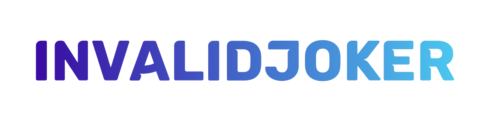

### 👋 About Me

┌ 🔭 × I’m currently working on [Pixel Playland](https://discord.gg/FKWNMS3KrP)

└ 🌱 × I’m currently learning **Game Hacking**

## 📊 GitHub stats

    
     
     
    

## 🔧 Languages and Tools

       <a href="https://nextjs.org/" target="_blank" rel="noreferrer">         

